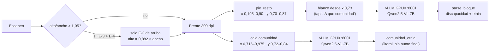

# Lote E3V2 — servidor 18.188.49.114

Pipeline de `backup/parte10-servidor-fisico/` con tres cambios:

1. `workers/casillas_vision.py`: el recorte de discapacidad+etnia
   (`pie_resto`) se pinta de blanco desde x = 0,73 de la página para tapar
   A QUE COMUNIDAD DE LA ETNIA PERTENECE (`CASILLAS_PIE_BLANCO_X`).
2. Campo nuevo `comunidad_etnia`: `workers/comunidad_vision.py` lee esa caja
   con su propio recorte (`LEER_COMUNIDAD=1`); `ocr_worker.py` y
   `nlp_worker.py` lo enganchan igual que dirección.
3. `workers/pagina_e3.py`: si el escaneo trae E-3 + E-4 (alto > 1,05 ×
   ancho), `ocr_worker.py` procesa solo el E-3 de arriba (alto = 0,882 ×
   ancho).

Resultados y forma de repetir: `docs/lote2-e3v2-parte10.md`.
