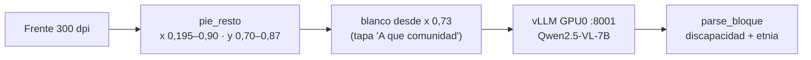

# Lote E3V2 — servidor 18.188.49.114

Pipeline de `backup/parte10-servidor-fisico/` con un solo cambio en
`workers/casillas_vision.py`: el recorte de discapacidad+etnia (`pie_resto`)
se pinta de blanco desde x = 0,73 de la página para tapar A QUE COMUNIDAD DE
LA ETNIA PERTENECE (`CASILLAS_PIE_BLANCO_X`).

Resultados y forma de repetir: `docs/lote2-e3v2-parte10.md`.
