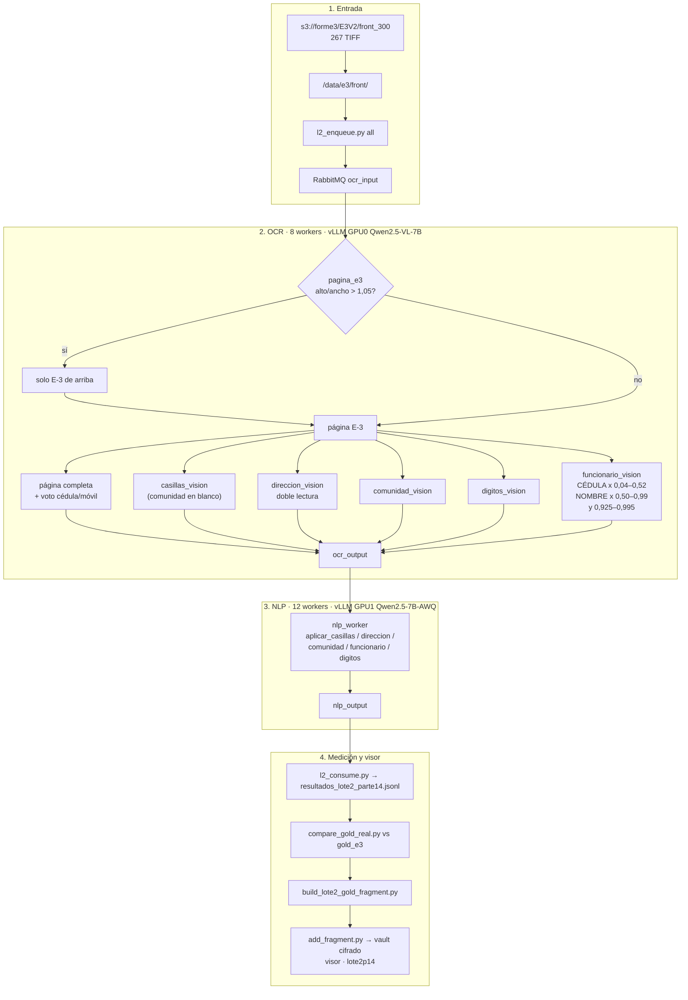

# Backup Parte 14 — Lote E3V2 + funcionario electoral

Carpeta **independiente** de la corrida **Lote E3V2 . Parte 14 (analisis 256
formularios)** del 5 oct 2026 en el servidor físico 18.188.49.114
(g7e.12xlarge, 2× RTX PRO 6000 96 GB). Es todo lo que se usó: workers tal
cual corrieron, `docker-compose.yml`, scripts de corrida, comparación,
visor y calibración, y KPIs agregados sin PII.

Se procesaron los **267** frentes de `s3://forme3/E3V2/front_300/` (en S3 no
hay otro set de 256; el nombre del menú es el pedido).

| Métrica | Parte 10 + dirección (anterior) | Parte 14 |
| --- | ---: | ---: |
| KPI oficial vs `gold_e3` (19 campos) | 93,2 % | **93,3 %** |
| comunidad_etnia | 97,4 % | 97,4 % |
| direccion | 90,4 % | 90,0 % |
| numero_documento | 86,9 % | 86,1 % |
| funcionario_cedula | — | leída en 267/267, **sin gold** |
| funcionario_nombre | — | leída en 267/267, **sin gold** |
| docs/h (meta 1250) | 871 | 845 |

Visor: https://shell931.github.io/e3-pages/ — menú
**Lote E3V2 . Parte 14 (analisis 256 formularios)** (clave `lote2p14`).
Detalle: `docs/lote2-e3v2-parte14.md`.

## En una frase

Mismo pipeline del Lote E3V2 (comunidad tapada en casillas,
`comunidad_etnia`, solo E-3 en páginas E-3+E-4, dirección sin complementos
inventados) y un lector nuevo, `workers/funcionario_vision.py`, para el pie
**INFORMACIÓN DEL FUNCIONARIO ELECTORAL RESPONSABLE DE LA INSCRIPCIÓN**:
CÉDULA (cuadritos, solo dígitos) y NOMBRE (manuscrito literal).

## Gold de los campos nuevos

El `gold_lote2.json` del servidor salió del `gold_e3.csv` sin las columnas
del funcionario y el CSV ya no está (se borró por PII). `compare_gold_real.py`
salta un campo si el gold no lo trae, así que el 93,3 % es sobre los mismos
19 campos de antes. Para medirlos:

```bash
python3 scripts/corrida/gold_csv_to_json.py gold_e3.csv /data/e3/gold/gold_lote2.json
python3 scripts/corrida/compare_gold_real.py /data/e3/gold/gold_lote2.json \
    /data/e3/preds_lote2p14.json "" lote2p14
```

`gold_csv_to_json.py` busca las columnas `FUNCIONARIO - CEDULA` /
`FUNCIONARIO - NOMBRE` o cualquier cabecera con FUNCIONARIO + CEDULA/NOMBRE.
`funcionario_cedula` es estricto (0/100); `funcionario_nombre` por similitud.

Revisión visual mientras tanto (23 formularios, imagen vs lectura): cédula
exacta en 17. Los errores son un dígito cambiado o perdido en cédulas
largas (como `numero_documento`).

## Flujo (diagrama)



## Flags

| Variable | Valor en la corrida | Qué hace |
| --- | --- | --- |
| `LEER_FUNCIONARIO` | `1` (default) | Lee cédula y nombre del funcionario |
| `FUNC_CED_X0/Y0/X1/Y1` | `0.04 / 0.925 / 0.52 / 0.995` | Recorte CÉDULA |
| `FUNC_NOM_X0/Y0/X1/Y1` | `0.50 / 0.925 / 0.99 / 0.995` | Recorte NOMBRE |
| `FUNC_ESCALA` | `2` | Escala del recorte (3 no mejoró) |
| `LEER_COMUNIDAD` / `DIR_DOBLE` | `1` | Igual que el lote anterior |
| `CASILLAS_PIE_BLANCO_X` | `0.73` | Tapa la caja de comunidad en casillas |
| `E3_RATIO_MAX` / `E3_ALTO_REL` | `1.05` / `0.882` | Solo E-3 en páginas altas |

## Qué hay aquí

| Ruta | Qué es |
| --- | --- |
| `LEEME.md` | Este archivo |
| `IMPLEMENTACION.md` | Cableado del lector nuevo, calibración, cómo repetir |
| `MANIFEST.md` | md5 de cada archivo |
| `docker-compose.yml` | Compose del servidor (rabbitmq, vllm-vl, vllm-nlp, ocr, nlp) |
| `workers/` | Los 12 archivos de `/app` tal cual corrieron (incluye `funcionario_vision.py`) |
| `scripts/corrida/` | `run_lote2.sh`, `l2_enqueue.py`, `l2_consume.py`, `preds_lote2.py`, `gold_csv_to_json.py`, `compare_gold_real.py`, `build_lote2_gold_fragment.py`, `add_fragment.py` (+ versiones `enqueue_lote2.py` / `consume_lote2.py` del repo) |
| `scripts/calibracion/` | Pruebas de recortes y prompts de todo el lote E3V2: `tfunc.py` / `tspot.py` (funcionario), `tcom*.py` (comunidad), `tdir.py` / `dirstats.py` (dirección), `alto.py` / `vnorm.py` (páginas E-3+E-4), `crop*.py`, `conf.py`, `diff.py`, `sub.py` |
| `scripts/visor/` | Chequeo del visor con Playwright (`E3_VAULT_USER` / `E3_VAULT_PASS` por entorno) |
| `kpis/` | `lote2-parte14-gold-kpis.json`: agregado por campo **sin PII** |

Sin PII en esta carpeta: ni TIFF, ni gold, ni CSV de comparación, ni
valores por documento (esos van solo dentro del vault cifrado del visor).
