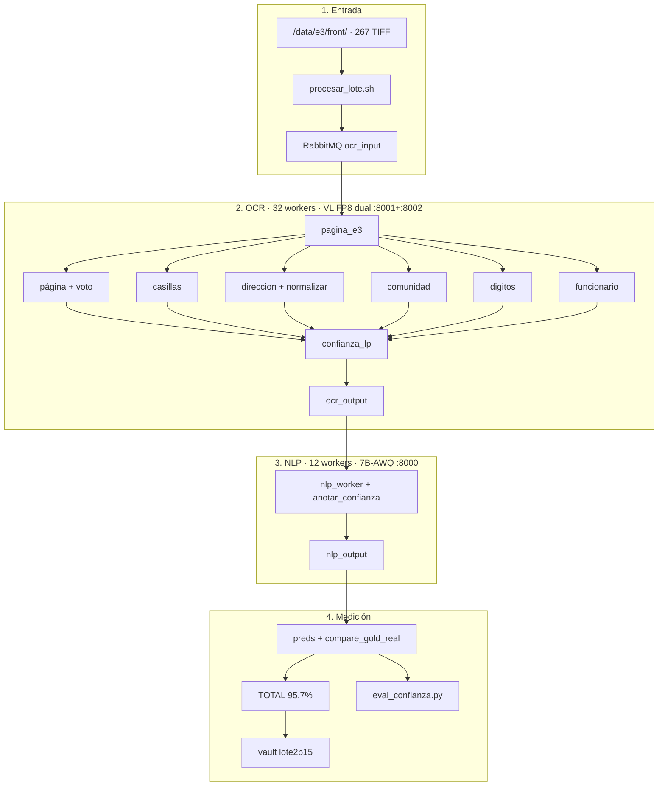

# Backup Parte 15 — Qwen3.6-27B-FP8 dual + logprobs + dirección

Carpeta **independiente** de la corrida **Lote E3V2 · Parte 15** del 6 oct
2026 en el servidor físico `18.188.49.114` (g7e.12xlarge, 2× RTX PRO 6000
96 GB). Incluye workers tal cual corrieron, `docker-compose.yml`
parametrizado, scripts de despliegue/corrida/p15, envs de modelos y KPIs
agregados **sin PII**.

La Parte 14 (`backup/parte-14-servidor-fisico/`) **no se toca**.

| Métrica | Parte 14 | Parte 15 |
| --- | ---: | ---: |
| KPI oficial `conf_real` (21 campos, 267 docs) | **92,4 %** | **95,7 %** |
| Exacto celda a celda | 81,6 % | 87,0 % |
| docs/h | ~852 | **934** |
| Campos `revisar` | ~85 | 1233 |
| Exactitud tras revisar (`LP_UMBRAL=80`) | — | **97,2 %** |

Para desplegar en un servidor nuevo: **`DESPLIEGUE.md`**.

Visor: https://shell931.github.io/e3-pages/ — menú
**Lote E3V2 · Parte 15 (Qwen3.6-27B-FP8 dual, 95.7%)** (clave `lote2p15`).
Detalle: `docs/lote2-e3v2-parte15.md`.

## En una frase

Mismo pipeline E3V2 de la Parte 14 (funcionario, comunidad, dirección,
casillas, solo E-3) con **Qwen3.6-27B-FP8** en dos réplicas VL, confianza
real por logprobs que marca `revisar`, y normalización ligera de formato
de dirección.

## Las tres mejoras

1. **Modelo VL** — screening en 80 docs; ganador FP8 dual (95,3 % @ 966
   docs/h en muestra → **95,7 % @ 934 docs/h** en full).
2. **Logprobs** — `workers/confianza_lp.py`; `conf_lp` = min prob de chars
   del valor; `revisar` si `< LP_UMBRAL` (80).
3. **Dirección** — `DIR_NORMALIZAR=1`: `-` sin espacios, `N°`→`N`, sin punto
   final. No expandir tipos de vía.

## Flujo



## Flags de la corrida ganadora

| Variable | Valor | Qué hace |
| --- | --- | --- |
| `VL_MODELO` / `VL_REV` | `Qwen/Qwen3.6-27B-FP8` / `e89b16eb…` | Pesos VL |
| `COMPOSE_PROFILES` | `doble` | Segunda réplica VL + `ocr2` |
| `VL_MEM` / `VL2_MEM` | `0.92` / `0.50` | Fracción VRAM GPU0 / GPU1 |
| `VL_EAGER` | `no-enforce-eager` | Más throughput |
| `VL_SEQS` / `OCR_WORKERS` | `16` / `16` (×2 = 32) | Concurrencia |
| `LEER_LOGPROBS` / `LP_MARCAR` | `1` / `1` | Confianza real + marcar |
| `LP_UMBRAL` | `80` | Umbral único |
| `DIR_NORMALIZAR` | `1` | Formato dirección |
| `LEER_CONTACTO` / `LEER_APELLIDO` | `0` / `0` | **No activar** (empeora) |

Env listo: `modelos/qwen36-27b-fp8-doble.env`.

```bash
bash scripts/p15/probar_modelo.sh modelos/qwen36-27b-fp8-doble.env front
```

## Qué hay aquí

| Ruta | Qué es |
| --- | --- |
| `LEEME.md` | Este archivo |
| `DESPLIEGUE.md` | Guía 2×GPU 96 GB (incluye descarga del FP8) |
| `IMPLEMENTACION.md` | Cableado logprobs / normalización / perfiles |
| `MANIFEST.md` | md5 de cada archivo |
| `docker-compose.yml` | Compose parametrizado + profile `doble` |
| `modelos/*.env` | Envs de screening y corrida ganadora |
| `workers/` | Incluye `confianza_lp.py` y cambios P15 |
| `scripts/p15/` | `probar_modelo.sh`, `eval_confianza.py`, `comparar_modelos.py` |
| `scripts/despliegue/` | `descargar_modelos.sh`, `verificar.sh`, `procesar_lote.sh`… |
| `scripts/corrida/` | compare / preds / fragment / vault |
| `kpis/` | Agregados sin PII + comparativa muestra 80 |

Gold y preds con PII: solo en el servidor (`~/e3/p15/res/`), nunca en git.
