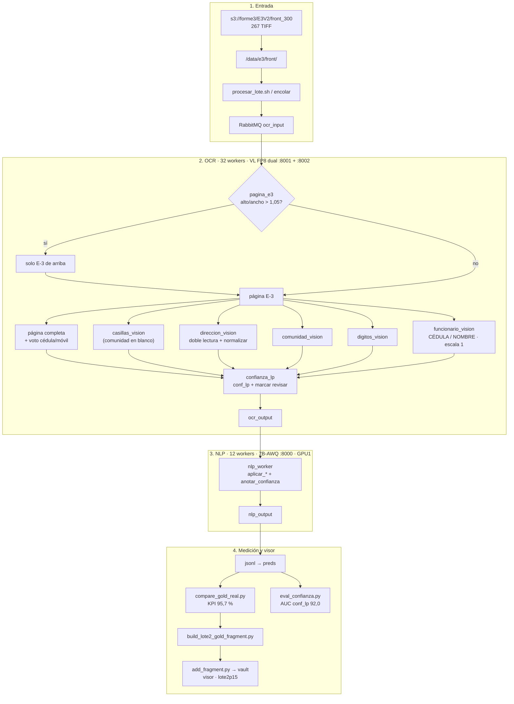

# Backup Parte 15 — Qwen3.6-27B-FP8 dual + logprobs + dirección

Carpeta **independiente** de la corrida **Lote E3V2 · Parte 15** del 6 oct
2026 en el servidor físico `18.188.49.114` (g7e.12xlarge, 2× RTX PRO 6000
96 GB). Es todo lo que se usó: workers tal cual corrieron, compose
parametrizado, scripts de despliegue/corrida/calibración/p15, envs de
modelos y KPIs agregados **sin PII**.

Se procesaron los mismos **267** frentes de `s3://forme3/E3V2/front_300/`
(`/data/e3/front`) y el mismo gold de 21 campos que la Parte 14
(`/data/e3/gold/gold_lote2.json`).

La Parte 14 (`backup/parte-14-servidor-fisico/`) **no se modifica**: queda
como baseline reproducible a 92,4 %.

| Métrica | Parte 14 (7B) | Parte 15 (27B-FP8 dual) | Δ |
| --- | ---: | ---: | ---: |
| KPI oficial `conf_real` (21 campos, 267 docs) | **92,4 %** | **95,7 %** | **+3,3 pp** |
| Exacto celda a celda | 81,6 % | 87,0 % | +5,4 pp |
| docs/h (meta 1250) | ~852 | **934** | +82 |
| Errores de corrida | 0 | 0 | — |
| Campos marcados `revisar` | ~85 | 1233 | política LP |
| Exactitud tras revisar marcadas | — | **97,2 %** | nuevo |
| AUC confianza | declarada ~48 | **`conf_lp` 92,0** | usable |

Para desplegar en un servidor nuevo: **`DESPLIEGUE.md`**.

Visor: https://shell931.github.io/e3-pages/ — menú
**Lote E3V2 · Parte 15 (Qwen3.6-27B-FP8 dual, 95.7%)** (clave `lote2p15`).
Detalle: `docs/lote2-e3v2-parte15.md`.

## En una frase

Misma arquitectura de formularios E3V2 de la Parte 14 (páginas solo E-3,
casillas, comunidad, dirección, dígitos, funcionario) cambiando el motor
de visión a **Qwen3.6-27B-FP8 en dos réplicas**, midiendo confianza real
con **logprobs** (marca `revisar`) y aplicando **normalización ligera** de
formato de dirección — sin fine-tuning.

---

## Arquitectura usada (Parte 15)

### Hardware y stack

| Pieza | Valor en la corrida |
| --- | --- |
| Host | `18.188.49.114` · Ubuntu · Docker Compose v2 |
| GPUs | 2× NVIDIA RTX PRO 6000 Blackwell Server Edition, 96 GB |
| Imagen vLLM | `vllm/vllm-openai@sha256:c2914767…` (fijada por digest) |
| Cola | RabbitMQ 3.13-management (digest fijado) · `ocr_input` / `ocr_output` / `nlp_output` |
| Datos | `/data/e3` (TIFF + gold) · `/data/hf-cache` (pesos HF) |
| Prefijo compose | `caso1v2e3e3-*` |

### Servicios Docker (perfil `doble`)

```
                    ┌─────────────────────────────────────────┐
  TIFF /data/e3/front │                                         │
         │            │  RabbitMQ :5672 / :15672                │
         ▼            └───────────────┬─────────────────────────┘
   ocr + ocr2  ◄── ocr_input ─────────┤
   (32 workers)                       │
         │                            │
         │  VL lecturas               │
         ├──────────► vllm-vl  :8001  │  GPU0 · Qwen3.6-27B-FP8
         │            mem 0.92        │  (réplica A)
         │                            │
         └──────────► vllm-vl2 :8002  │  GPU1 · Qwen3.6-27B-FP8
                      mem 0.50        │  (réplica B)
         │                            │
         ▼ ocr_output                 │
        nlp (12) ────► vllm-nlp :8000 │  GPU1 · Qwen2.5-7B-Instruct-AWQ
                      mem 0.40        │
         │                            │
         ▼ nlp_output                 │
   preds → compare_gold_real → KPI    │
         → eval_confianza → vault     │
```

| Contenedor | Puerto | Modelo / rol | GPU | VRAM típica |
| --- | --- | --- | --- | --- |
| `vllm-vl` | :8001 | `Qwen/Qwen3.6-27B-FP8` · visión OCR + recortes (A) | 0 | ~90 GB |
| `vllm-vl2` | :8002 | mismo FP8 · réplica B (`COMPOSE_PROFILES=doble`) | 1 | ~50 GB |
| `vllm` (nlp) | :8000 | `Qwen/Qwen2.5-7B-Instruct-AWQ` · JSON / NLP | 1 | ~40 GB |
| `ocr` + `ocr2` | — | 16+16 = **32** workers OCR | CPU | — |
| `nlp` | — | **12** workers NLP | CPU | — |
| `rabbitmq` | :5672/:15672 | colas | — | — |

Revisión VL fijada: `VL_REV=e89b16ebf1988b3d6befa7de50abc2d76f26eb09`.  
NLP: `b25037543e9394b818fdfca67ab2a00ecc7dd641`.

### Pipeline por formulario (herencia Parte 14 + P15)

1. **Entrada** — TIFF 300 dpi en `/data/e3/front/{doc_id}.tif`.
2. **`pagina_e3`** — si alto/ancho > `E3_RATIO_MAX` (1,05), recorta solo el
   E-3 superior (`E3_ALTO_REL=0.882`); ignora E-4 pegado.
3. **Lecturas VL** (OCR worker, ahora contra FP8 dual):
   - página completa + voto cédula/móvil
   - `casillas_vision` (comunidad tapada con `CASILLAS_PIE_BLANCO_X=0.73`)
   - `direccion_vision` (doble lectura + **`DIR_NORMALIZAR`**)
   - `comunidad_vision` → `comunidad_etnia`
   - `digitos_vision` (cédula / celular)
   - `funcionario_vision` (cédula cuadrito a cuadrito + nombre con 2ª lectura)
4. **`confianza_lp`** (**nuevo P15**) — pide logprobs a vLLM; escribe
   `conf_lp` (0–100) y marca `revisar` si `< LP_UMBRAL`.
5. **NLP** — `nlp_worker` aplica casillas / dirección / comunidad /
   funcionario / dígitos; `anotar_confianza` refuerza la política `revisar`.
6. **Medición** — `compare_gold_real.py` (KPI oficial = promedio
   `conf_real` celda a celda) + `eval_confianza.py` + fragmento vault
   `lote2p15`.

### Flujo (diagrama)



---

## Qué cambió vs la implementación anterior (Parte 14)

### Resumen ejecutivo

| Área | Parte 14 | Parte 15 | Efecto medido |
| --- | --- | --- | --- |
| Modelo VL | Qwen2.5-VL-**7B** · 1 réplica · :8001 | Qwen3.6-**27B-FP8** · **2 réplicas** · :8001+:8002 | +3,3 pp KPI · +82 docs/h |
| Workers OCR | 8 | **32** (16×2) | satura las 2 réplicas VL |
| NLP | 7B-AWQ · 12 workers · GPU1 | **igual** (mem 0,40; VL2 usa 0,50 del resto) | sin cambio de motor NLP |
| Confianza | solo score declarado del extractor (poco fiable) | **`conf_lp` por logprobs** + `revisar` | AUC 92,0 vs ~48 declarada |
| Dirección | doble lectura anti-inventos | + **`DIR_NORMALIZAR`** (formato; no expandir vía) | exactos dirección 15,7 → **32,6 %** |
| Contacto / 1er apellido VL | off (7B no aportaba) | siguen **off** | activarlos en 27B **empeora** email |
| Campos / gold | 21 campos, 267 docs | **igual** | comparación manzana-manzana |
| Visor | `lote2p14` | **`lote2p15`** (no pisa P14) | menú nuevo |

### 1. Modelo VL más grande (sin fine-tuning)

Screening en `/data/e3/p15_muestra80` (80 docs, `random.seed(15)`), baseline
7B en muestra **91,2 %**:

| Config | KPI muestra | docs/h |
| --- | ---: | ---: |
| qwen25vl-7b | 91,2 % | — (full ~853) |
| qwen25vl-32b | 86,5 % | 202 |
| qwen25vl-72b-awq | 92,3 % | 167 |
| qwen3vl-32b | 92,8 % | 226 |
| qwen38-27b | 94,5 % | 281 |
| qwen36-27b | 95,5 % | 281 |
| qwen36-27b-fp8-rapido | 95,2 % | 585 |
| **qwen36-27b-fp8-doble** | **95,3 %** | **966** |
| fp8-doble + contacto/apellido | 95,1 % | 825 |

**Elegido:** `modelos/qwen36-27b-fp8-doble.env` → full 267 = **95,7 % @ 934 docs/h**.

Control: el **código P15 con VL 7B** en los 267 da **92,3 %** (ruido vs
92,4 % P14). La ganancia viene del modelo, no del cableado nuevo.

### 2. Confianza real vía logprobs

Antes la “confianza” del extractor era casi inútil (muchas celdas al 100 %
mal). P15 agrega `workers/confianza_lp.py`:

- `conf_lp` = mínimo de probs de los caracteres del valor emitido (0–100).
- Si `LP_MARCAR=1` y `conf_lp < LP_UMBRAL` → `revisar=true`,
  `revisar_por=["conf_lp"]`.
- Umbral ganador único: **80** (~22 % celdas, atrapa ~79 % de errores,
  exactitud tras revisar ≈ **97,2 %**).
- Casillas: `LP_CASILLA_MODO=elegida` (mejor que `min` en 7B).

No mejora la lectura sola; sí la revisión humana.

### 3. Normalización de dirección

`DIR_NORMALIZAR=1` en `direccion_vision.normalizar_formato`:

1. espacios alrededor de `-` → `-`
2. `N°` / `Nº` → `N`
3. quitar punto final
4. colapsar espacios

**No** se expanden `CL`/`CRA`/`KRA`/`CLL` → `CALLE`/…: el gold es literal y
esa expansión baja exactos. `No.`→`N` también empeora (gold mixto).

El salto grande de dirección (15,7 → 32,6 % exacto) lo da el 27B; el
formateo suma poco. El cuello de botella sigue siendo lectura.

### Qué se heredó sin cambios de Parte 14

- Gold 21 campos (incl. `funcionario_cedula` / `funcionario_nombre`).
- `pagina_e3`, casillas con comunidad tapada, `comunidad_vision`,
  `digitos_vision`, `funcionario_vision` (escala 1, doble nombre).
- Dirección con doble lectura anti-complementos inventados.
- NLP 7B-AWQ, RabbitMQ, imágenes por digest.
- Scripts de calibración P14 (`tfunc*`, `tnom*`, `tcom*`, `tdir`, …).

### Qué no hacer

- **No** activar `LEER_CONTACTO=1` / `LEER_APELLIDO=1` con este modelo
  (email 49→36 % en muestra).
- **No** reemplazar el menú `lote2p14` del visor.
- **No** subir preds/jsonl/gold con PII a git.

---

## Deltas por campo (exacto % · P14 → P15)

| Campo | P14 | P15 | Δ |
| --- | ---: | ---: | ---: |
| direccion | 15,7 | 32,6 | **+16,9** |
| funcionario_cedula | 73,8 | 88,8 | **+15,0** |
| funcionario_nombre | 52,1 | 64,4 | **+12,3** |
| email | 41,6 | 51,7 | +10,1 |
| etnia | 90,3 | 99,6 | +9,3 |
| lee_braille | 91,4 | 99,6 | +8,2 |
| ciudad | 90,3 | 96,6 | +6,3 |
| comunidad_etnia | 92,1 | 97,4 | +5,3 |
| telefono_movil | 75,7 | 80,1 | +4,4 |
| segundo_apellido | 81,3 | 85,4 | +4,1 |
| numero_documento | 86,1 | 89,9 | +3,8 |
| telefono_fijo | 91,3 | 95,1 | +3,8 |
| tipo_discapacidad | 96,3 | 99,6 | +3,3 |
| fecha_expedicion | 93,3 | 96,3 | +3,0 |
| segundo_nombre | 84,6 | 87,6 | +3,0 |
| fecha_inscripcion | 93,6 | 94,8 | +1,2 |
| nivel_estudio | 98,5 | 99,6 | +1,1 |
| formulario_no | 99,6 | 100,0 | +0,4 |
| primer_nombre | 85,4 | 85,8 | +0,4 |
| tipo_documento | 100,0 | 100,0 | 0 |
| primer_apellido | 82,0 | 81,6 | −0,4 |

---

## Flags de la corrida ganadora

| Variable | Valor | Qué hace |
| --- | --- | --- |
| `VL_MODELO` / `VL_REV` | `Qwen/Qwen3.6-27B-FP8` / `e89b16eb…` | Pesos VL |
| `COMPOSE_PROFILES` | `doble` | `vllm-vl2` + `ocr2` |
| `VL_MEM` / `VL2_MEM` | `0.92` / `0.50` | VRAM GPU0 / réplica en GPU1 |
| `VL_EAGER` | `no-enforce-eager` | Más throughput |
| `VL_SEQS` / `OCR_WORKERS` | `16` / `16` (×2 = 32) | Concurrencia |
| `LEER_LOGPROBS` / `LP_MARCAR` | `1` / `1` | Confianza real + marcar |
| `LP_UMBRAL` | `80` | Umbral único `conf_lp` |
| `DIR_NORMALIZAR` | `1` | Formato dirección |
| `LEER_CONTACTO` / `LEER_APELLIDO` | `0` / `0` | **No activar** |
| `LEER_FUNCIONARIO` / `DIR_DOBLE` / `LEER_COMUNIDAD` | `1` | Igual que P14 |
| `FUNC_ESCALA` / `FUNC_NOM_DOBLE` / `FUNC_NOM_UMBRAL` | `1` / `1` / `90` | Igual que P14 |
| `CASILLAS_PIE_BLANCO_X` | `0.73` | Igual que P14 |
| `E3_RATIO_MAX` / `E3_ALTO_REL` | `1.05` / `0.882` | Solo E-3 en páginas altas |

Env listo: `modelos/qwen36-27b-fp8-doble.env`.

```bash
# Corrida medible (recreate VL/OCR + KPI + confianza)
bash scripts/p15/probar_modelo.sh modelos/qwen36-27b-fp8-doble.env front

# Comparación vs gold (igual que P14)
python3 scripts/corrida/compare_gold_real.py \
  /data/e3/gold/gold_lote2.json preds.json "" qwen36-27b-fp8-doble_front
```

---

## Qué hay aquí

| Ruta | Qué es |
| --- | --- |
| `LEEME.md` | Este archivo (arquitectura + delta vs P14) |
| `DESPLIEGUE.md` | Guía 2×GPU 96 GB (descarga FP8, profile `doble`, aceptación) |
| `IMPLEMENTACION.md` | Cableado logprobs / normalización / screening |
| `MANIFEST.md` | md5 de cada archivo |
| `docker-compose.yml` | Compose parametrizado + profile `doble` |
| `modelos/*.env` | Envs de screening y corrida ganadora |
| `workers/` | Incluye `confianza_lp.py` y cambios P15 sobre P14 |
| `scripts/p15/` | `probar_modelo.sh`, `eval_confianza.py`, `comparar_modelos.py` |
| `scripts/despliegue/` | `descargar_modelos.sh`, `verificar.sh`, `procesar_lote.sh`, … |
| `scripts/corrida/` | compare / preds / fragment / vault |
| `scripts/calibracion/` | Suite P14 (reutilizada) |
| `scripts/visor/` | Chequeos Playwright |
| `kpis/` | Agregados sin PII + comparativa muestra 80 + KPI/LP de la corrida |

Sin PII en esta carpeta: ni TIFF, ni gold, ni CSV de comparación, ni
valores por documento (esos van solo dentro del vault cifrado del visor /
`~/e3/p15/res/` en el servidor).
