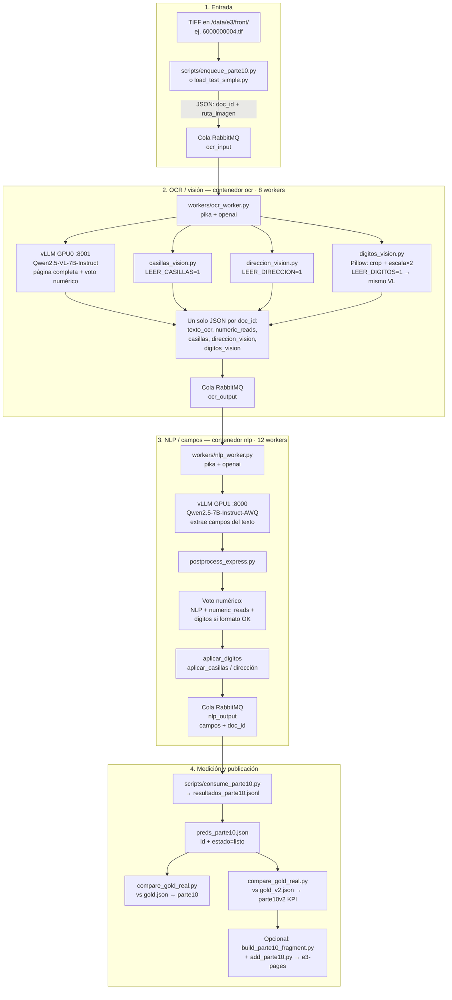

# Backup Parte 10 — reinstalar tal cual en un servidor físico

Esta carpeta es **independiente** de `backup/parte8-servidor-fisico/`.
Es la copia exacta del pipeline que midió y publicó **Parte 10**
(25 sep 2026):

| Métrica | Valor |
| --- | ---: |
| Contra `gold_v2` (**KPI oficial**) | **89,6 %** |
| Contra `gold.json` (original) | **88,4 %** |
| `numero_documento` | **88 %** |
| `telefono_movil` (gold / gold_v2) | 40 % / 58 % |
| `tipo_discapacidad` | 91 % |
| Throughput (docs/h, meta 1250) | **872** (~6 min 53 s / 100) |

Visor: https://shell931.github.io/e3-pages/ — menú **Parte 10**.
Detalle de diseño: `IMPLEMENTACION.md` en esta carpeta y
`docs/parte10-resultados.md` en la raíz del repo.

## En una frase (qué es Parte 10)

Plan original: lector dedicado de dígitos (celular + cédula) + VL
cuantizado *si hace falta VRAM*, midiendo siempre vs gold y vs gold_v2,
sin pisar Parte 8/9.

### De qué trata el lector dedicado de dígitos

**No es otro modelo.** Es un paso extra del mismo pipeline:

1. Recorta solo las cajas de **cédula**, **móvil** y **fijo** en el TIFF.
2. Las amplía (escala 2) y se las pasa al VL pidiendo **solo dígitos**
   (temperatura 0).
3. Esa lectura entra al **voto** junto con NLP + las 2 lecturas de página
   completa, y luego `aplicar_digitos` pisa el campo solo si el formato
   es claro (móvil: 10 dígitos que empiezan por 3; cédula: 8–10 dígitos).
   El fijo se lee pero **no se aplica** (en pruebas contaminaba con el
   móvil de arriba).

Código: `workers/digitos_vision.py`, flag `LEER_DIGITOS=1`.

### ¿Se cuantizó el VL?

**No.** El plan decía cuantizar *si hace falta VRAM* para meter un
segundo modelo; no hizo falta como plan B: GPU0 ya tenía ~90 GB
reservados con el Qwen2.5-VL-7B completo. En vez de cuantizar o meter
RapidOCR/Paddle, se reutilizó ese mismo VL 7B sobre los recortes.

El NLP sigue en AWQ (eso ya venía de antes). El VL de visión **no** se
cuantizó en Parte 10. Parte 8 y Parte 9 del visor no se tocaron.

### Cómo se relaciona el recorte con el formulario (sin mezclar)

No hay cola aparte de recortes ni hash de imagen. Todo va **en el mismo
mensaje** del formulario:

1. A `ocr_input` entra, por ejemplo,
   `{ "doc_id": "6000000004", "ruta_imagen": "/data/e3/front/6000000004.tif" }`.
2. Un worker OCR toma **ese** mensaje, abre **esa** ruta y, en el mismo
   proceso Python, hace página completa + casillas + recortes de dígitos
   sobre ese TIFF (`digitos_vision.py` vía Pillow).
3. El resultado de dígitos **no viaja suelto**: se mete en el mismo JSON
   como campo `digitos_vision`, junto con el `doc_id`, y eso se publica
   a `ocr_output`.
4. El NLP lee ese mensaje, aplica voto / `aplicar_digitos` a **esos**
   campos y publica a `nlp_output` otra vez con el mismo `doc_id`.

Otro formulario = otro mensaje, otra ruta, otro `digitos_vision`. No hay
recortes huérfanos en la cola.

Quién hace el recorte+zoom: el script Python `workers/digitos_vision.py`,
llamado desde `workers/ocr_worker.py` cuando `LEER_DIGITOS=1` (dentro del
contenedor OCR, 8 procesos).

## Flujo completo (diagrama)

Tecnologías por fase: **Docker Compose**, **RabbitMQ** (colas),
**vLLM** (API OpenAI-compatible), **Pillow** (recorte/escala),
**pika** (clientes de cola), scripts en `workers/` y `scripts/`.



Resumen de piezas:

| Fase | Tecnología | Script / servicio |
| --- | --- | --- |
| Encolar | RabbitMQ, pika | `scripts/enqueue_parte10.py` |
| Visión | vLLM + Qwen2.5-VL-7B, Pillow | `ocr_worker.py`, `digitos_vision.py`, `casillas_vision.py`, `direccion_vision.py` |
| Campos | vLLM + Qwen2.5-7B-AWQ | `nlp_worker.py`, `postprocess_express.py` |
| Medir | Python stdlib | `consume_parte10.py`, `compare_gold_real.py` |
| Orquestación | Docker Compose | `docker-compose.yml` (8 OCR + 12 NLP) |

## Qué cambia entre Parte 8 y Parte 10

Entre Parte 8 y Parte 10 el **stack es el mismo** (Docker, RabbitMQ,
8 OCR + 12 NLP, VL 7B en GPU0, NLP AWQ en GPU1). Cambia el **paso de
dígitos** y cómo se mide.

| | Parte 8 | Parte 10 |
| --- | --- | --- |
| Lector de dígitos | No | Sí: `digitos_vision.py` (recorte + zoom ×2 → mismo VL) |
| Flag nuevo | — | `LEER_DIGITOS=1` |
| Voto numérico | NLP + 2 lecturas de **página** | Eso **+** recorte de dígitos (si formato OK) |
| `aplicar_digitos` | No | Sí (móvil 10 dígitos tipo `3…`; cédula 8–10; fijo no se aplica) |
| Casillas / dirección | ON | ON (igual) |
| Contacto / apellido | OFF | OFF (igual) |
| Regla NINGUNA discapacidad | No (llega en Parte 9) | Sí (heredada de Parte 9) |
| KPI oficial | **87,8 %** vs `gold` | **89,6 %** vs `gold_v2` |
| Misma corrida vs gold | 87,8 % | **88,4 %** |
| Cédula exacta | 86 % | **88 %** |
| docs/h (meta 1250) | **968** | **872** (más VL calls por doc) |

En corto: Parte 10 no cambia modelos ni colas; añade un script Python que
recorta cédula/móvil, los pasa al mismo VL y mete esa lectura en el voto
del mismo `doc_id`. Parte 8/9 del visor no se pisan.

No trae las imágenes TIFF ni el gold (datos personales). Hay que
copiarlos aparte **mientras el servidor AWS siga encendido** (paso 1).

## Qué hay aquí

| Ruta | Qué es |
| --- | --- |
| `IMPLEMENTACION.md` | Documentación completa de Parte 10: módulo, flags, reglas, calibración, qué no se tocó. |
| `LEEME.md` | Este archivo: cómo desplegar y repetir la corrida. |
| `workers/` | Python exactos del servidor AWS el día de la medición (incluye `digitos_vision.py`, regla NINGUNA, dirección, etc.). |
| `docker-compose.yml` | RabbitMQ + vLLM VL (GPU 0) + vLLM NLP (GPU 1) + 8 OCR + 12 NLP. Imagen vLLM fijada al digest `sha256:c29147676055…`. |
| `scripts/` | Carga, consumo, comparación oficial, enqueue/consume Parte 10, fragmento del visor. |
| `kpis/parte10-gold.json` | Agregado vs gold original (**sin PII**). |
| `kpis/parte10v2-gold.json` | Agregado vs gold_v2 (**sin PII**) — el del KPI. |
| `gold_v2_resumen.json` | Ids de teléfonos confirmados en gold_v2, **sin** los números. |

## Hardware de la corrida publicada

Dos NVIDIA RTX PRO 6000 Blackwell, 97.887 MiB cada una. Driver 595.84.
Docker 29.1.3, Compose 2.40.3.

vLLM reserva el **90 %** de la GPU 0 para el VL y el **40 %** de la GPU 1
para el NLP. Esas dos reservas **no caben en una sola** tarjeta de 96 GB.
Un servidor físico con dos GPU de esa clase puede usar este
`docker-compose.yml` tal cual. Con tarjetas más chicas hay que bajar
`--gpu-memory-utilization` y `--max-model-len` antes de arrancar.

Modelos (no van en git; se descargan a `/data/hf-cache`):

- Visión: `Qwen/Qwen2.5-VL-7B-Instruct` (~15,5 GiB)
- NLP: `Qwen/Qwen2.5-7B-Instruct-AWQ` (~5,2 GiB)

**No se cuantizó el VL** en Parte 10: no había VRAM libre para un segundo
modelo; se reutiliza el 7B sobre recortes.

## Flags tal cual la corrida

| Variable | Default Parte 10 |
| --- | --- |
| `LEER_DIGITOS` | **1** (nuevo) |
| `LEER_CASILLAS` | 1 |
| `LEER_DIRECCION` | 1 |
| `VOTE_NUMERIC` | 1 |
| `BACKFILL_FORMULARIO` | 1 |
| `LEER_CONTACTO` | **0** |
| `LEER_APELLIDO` | **0** |
| `DIGITOS_ESCALA` | **2** |

Recortes de cédula (defaults en `digitos_vision.py`):
`CED_X0=0.02 CED_Y0=0.330 CED_X1=0.55 CED_Y1=0.410`.

## 1. Copiar imágenes y gold, ahora

Desde una máquina con la llave SSH del servidor AWS actual:

```bash
export SSH_KEY="$HOME/Documents/KEYS/llave/OT-IA-SERVER.pem"
export DEST="/ruta/del/disco/e3"   # backup de datos (NO subir a git)
mkdir -p "$DEST/front" "$DEST/gold"
rsync -av -e "ssh -i $SSH_KEY" \
  ubuntu@3.17.139.133:/data/e3/front/ "$DEST/front/"
rsync -av -e "ssh -i $SSH_KEY" \
  ubuntu@3.17.139.133:/data/e3/gold/gold.json \
  ubuntu@3.17.139.133:/data/e3/gold/gold_v2.json \
  ubuntu@3.17.139.133:/data/e3/gold/gold_v2_cambios.json \
  "$DEST/gold/"
```

Son 100 TIFF de frente (`6000000001`–`6000000101` excepto `6000000033`),
más `gold.json` y `gold_v2.json`.

## 2. Preparar el servidor físico

Ubuntu con **dos** GPU visibles en `nvidia-smi`. Instala Docker y el
NVIDIA Container Toolkit. Comprueba:

```bash
docker run --rm --gpus all nvidia/cuda:12.8.0-base-ubuntu24.04 nvidia-smi
```

```bash
sudo mkdir -p /data/e3/front /data/e3/gold /data/hf-cache
sudo chown -R "$USER" /data/e3 /data/hf-cache
cp -a "$DEST/front/." /data/e3/front/
cp -a "$DEST/gold/." /data/e3/gold/
```

El primer arranque descarga los modelos a `/data/hf-cache` (hace falta
salida a `huggingface.co`).

## 3. Levantar el stack

En esta carpeta (`backup/parte10-servidor-fisico`):

```bash
docker compose up -d
docker compose logs -f vllm-vl vllm
```

Espera a que ambos vLLM digan que la app arrancó. Luego:

```bash
docker compose ps
nvidia-smi --query-gpu=index,name,memory.used,memory.total --format=csv
```

GPU 0 = VL, GPU 1 = NLP, memoria reservada desde el arranque.

Los workers OCR/NLP instalan `pika`, `openai` y `pillow` al arrancar
(`workers/requirements.txt`) y dejan 8 y 12 procesos dentro de cada
contenedor.

## 4. Correr los 100 (Parte 10)

Purga colas, encola 100, consume a JSONL (vía contenedor OCR, que ya
tiene `pika` y monta `/data/e3` y `./workers`):

```bash
docker exec caso1v2e3e3-rabbitmq rabbitmqctl purge_queue ocr_input
docker exec caso1v2e3e3-rabbitmq rabbitmqctl purge_queue ocr_output
docker exec caso1v2e3e3-rabbitmq rabbitmqctl purge_queue nlp_output

# Los scripts viven en ./scripts; cópialos al volume workers o ejecuta así:
docker cp scripts/enqueue_parte10.py caso1v2e3e3-ocr:/app/enqueue_parte10.py
docker cp scripts/consume_parte10.py caso1v2e3e3-ocr:/app/consume_parte10.py

# Consumir en background y luego encolar
docker exec -d caso1v2e3e3-ocr python /app/consume_parte10.py
docker exec caso1v2e3e3-ocr python /app/enqueue_parte10.py
```

`consume_parte10.py` escribe en el volume montado:
`workers/_resultados_parte10.jsonl` → muévelo a `/data/e3/`:

```bash
cp workers/_resultados_parte10.jsonl /data/e3/resultados_parte10.jsonl

python3 - << 'PY'
import json
rows = []
for line in open("/data/e3/resultados_parte10.jsonl"):
    r = json.loads(line)
    r["id"] = r.get("id") or r.get("doc_id")
    r["estado"] = r.get("estado") or "listo"
    rows.append(r)
by = {r["id"]: r for r in rows}
json.dump(list(by.values()), open("/data/e3/preds_parte10.json", "w"),
          ensure_ascii=False, indent=2)
print(len(by))
PY

python3 scripts/compare_gold_real.py \
  /data/e3/gold/gold.json /data/e3/preds_parte10.json "" parte10
python3 scripts/compare_gold_real.py \
  /data/e3/gold/gold_v2.json /data/e3/preds_parte10.json "" parte10v2
```

El número oficial de Parte 10 es `conf_real` de `parte10v2-gold.json`
(**89,6** en la corrida publicada). El de `parte10-gold.json` es la
misma corrida contra el gold original (**88,4**).

Las salidas con texto de cada campo son datos personales: no las subas
a git.

## 5. Comprobar que es el mismo pipeline

```bash
docker logs caso1v2e3e3-vllm-vl 2>&1 \
  | grep -E "model_tag|Checkpoint size|Model loading took" | head -4
docker logs caso1v2e3e3-ocr 2>&1 | grep -E "LEER_DIGITOS|Worker listo|digitos" | head
docker exec caso1v2e3e3-ocr python -c "from digitos_vision import ESCALA, REGIONES; print(ESCALA, REGIONES['numero_documento'])"
```

Esperado: `ESCALA 2` y caja `(0.02, 0.33, 0.55, 0.41)`.

Rabbit de este compose usa `guest`/`guest` y publica 5672/15672. En un
servidor expuesto a red, cambia usuario y contraseña antes de levantarlo.

## Relación con el backup de Parte 8

`backup/parte8-servidor-fisico/` documenta Parte 8 (+ notas 9/10).
**Esta carpeta** es el paquete autocontenido para repetir **solo** el
estado Parte 10. No mezcles workers entre carpetas si quieres números
reproducibles.
