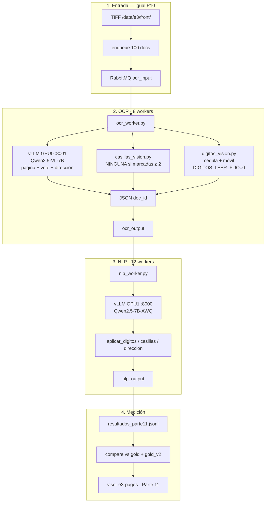

# Backup Parte 11 — casillas NINGUNA≥2 + throughput

Carpeta **independiente** del pipeline medido como **Parte 11**
(27 sep 2026). No pisa Parte 8/9/10 del visor.

| Métrica | Parte 10 | Parte 11 |
| --- | ---: | ---: |
| vs `gold.json` | 88,4 % | 88,4 % |
| vs `gold_v2` (**KPI**) | **89,6 %** | 89,5 % |
| `tipo_discapacidad` | 91 % | **92 %** |
| docs/h (meta 1250) | 872 | ~**880** |

Visor: https://shell931.github.io/e3-pages/ — menú **Parte 11**.
Detalle: `docs/parte11-resultados.md` en la raíz del repo.

## En una frase

Tres tweaks post–Parte 10: ampliar la regla NINGUNA de discapacidad,
omitir la pasada VL de teléfono fijo, y reforzar el prompt de
nombres/email. KPI global **plano** (jitter); no reemplaza Parte 10
como mejor resultado. Sí conviene quedarse con NINGUNA≥2.

## Qué cambió vs Parte 10

| Archivo | Cambio |
| --- | --- |
| `workers/casillas_vision.py` | `marcadas == 2` → `marcadas >= 2` si hay `NINGUNA` |
| `workers/casillas_vision.py` | Prompt: X fina cuenta en nivel/braille |
| `workers/digitos_vision.py` | No llama VL a `telefono_fijo` (`DIGITOS_LEER_FIJO=0`) |
| `workers/ocr_worker.py` | Orden apellidos/nombres + letras parecidas en email |

Stack Docker / colas / modelos: **igual** que Parte 10.

## Flujo (diagrama)

## Qué hay aquí

| Ruta | Qué es |
| --- | --- |
| `LEEME.md` | Este archivo |
| `IMPLEMENTACION.md` | Detalle técnico de los 3 cambios |
| `workers/` | Python del día de la medición |
| `docker-compose.yml` | Stack sin VL-small (igual P10) |
| `scripts/` | Fragmento + inyección al vault |
| `kpis/` | Agregados vs gold / gold_v2 (**sin PII**) |

## Redeploy rápido

Mismos pasos que `backup/parte10-servidor-fisico/LEEME.md`
(TIFF + gold aparte, `docker compose up`, enqueue 100, comparar).
Flags: `LEER_DIGITOS=1`, `LEER_CASILLAS=1`, `DIGITOS_LEER_FIJO=0`.
