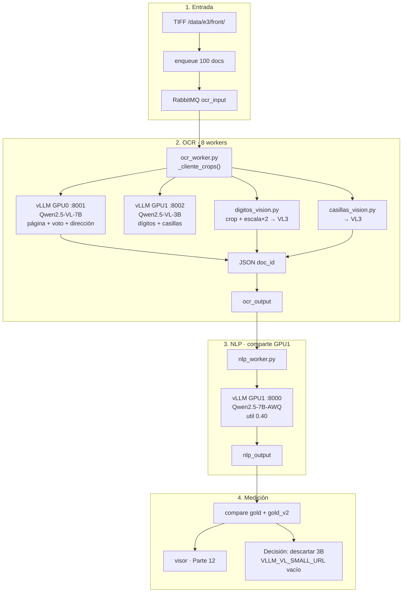

# Backup Parte 12 — VL 3B en dígitos/casillas (descartado)

Carpeta **independiente** del experimento **Parte 12** (28 sep 2026).
No usar como baseline de producción.

| Métrica | Parte 10 | Parte 12 |
| --- | ---: | ---: |
| vs `gold.json` | **88,4 %** | 69,8 % |
| vs `gold_v2` | **89,6 %** | 71,0 % |
| `nivel_estudio` | 94 % | **1 %** |
| `tipo_discapacidad` | 91–92 % | **11 %** |
| `lee_braille` | 91 % | **19 %** |
| `numero_documento` | 88 % | 84 % |
| docs/h (meta 1250) | 872 | **872** |

Visor: https://shell931.github.io/e3-pages/ — menú **Parte 12**
(marcado como experimento descartado).
Detalle: `docs/parte12-resultados.md`.

## En una frase

Segundo vLLM con **Qwen2.5-VL-3B-Instruct** en GPU1 `:8002` solo para
crops de dígitos y casillas; página / voto / dirección siguen en el 7B
(GPU0). Casillas colapsan; throughput **no** mejora (el 7B de página
domina el wall-clock).

## Deducción

- Tamaño del VL importa en casillas E3 (marcas finas / layout).
- Para ~1250 docs/h hay que recortar pasadas del 7B o perfil vLLM,
  no sustituir casillas por un 3B.

## Flujo (diagrama)

GPU1: NLP AWQ ~0.40 + VL-small 0.45 ≈ 0.85 de VRAM (cupo OK en RTX PRO 6000).

## Flags

| Variable | Valor en la corrida | Default recomendado |
| --- | --- | --- |
| `VLLM_VL_SMALL_URL` | `http://vllm-vl-small:8000/v1` | `""` (usar 7B) |
| `VLLM_VL_SMALL_MODEL` | `Qwen/Qwen2.5-VL-3B-Instruct` | idem |
| `LEER_DIGITOS` / `LEER_CASILLAS` | `1` | `1` |

Tras medir: contenedor `vllm-vl-small` detenido; OCR con URL vacía.

## Qué hay aquí

| Ruta | Qué es |
| --- | --- |
| `LEEME.md` | Este archivo |
| `IMPLEMENTACION.md` | Cableado, compose, por qué se descartó |
| `workers/` | Incluye `_cliente_crops()` en `ocr_worker.py` |
| `docker-compose.yml` | Servicio `vllm-vl-small` + URL vacía por defecto |
| `scripts/` | Fragmento + inyección vault |
| `kpis/` | Agregados vs gold / gold_v2 (**sin PII**) |
