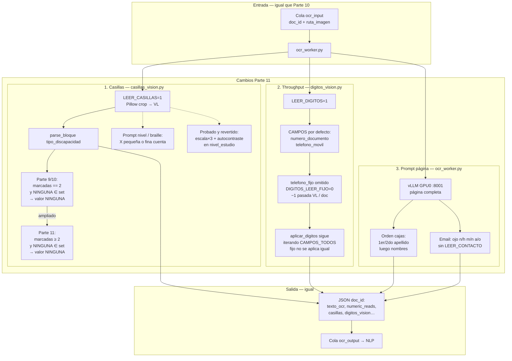

# Parte 11 — casillas NINGUNA≥2 + throughput (sin VL fijo)

Corrida de prueba sobre las 3 líneas de mejora post–Parte 10.
**No reemplaza el KPI publicado de Parte 10** (89,6 % vs gold_v2):
esta corrida quedó en el mismo orden (jitter).

## Qué se aplicó

1. **Casillas**: si `tipo_discapacidad` tiene 2+ marcas y una es `NINGUNA`,
   se conserva `NINGUNA` (antes solo con exactamente 2). Prompts mencionan
   X finas en nivel/braille. Escala 3 + autocontraste en nivel se probó y
   se revirtió (bajaba docs/h sin ganar braille).
2. **Throughput**: `DIGITOS_LEER_FIJO=0` (default): no se llama al VL para
   teléfono fijo (igual no se aplicaba).
3. **Nombres/email**: refuerzo en el prompt de página completa (orden de
   cajas; letras parecidas). Sin reactivar `LEER_CONTACTO` / `LEER_APELLIDO`.

## Qué cambió técnicamente (vs Parte 10)

El stack Docker / colas / modelos no muda. Solo tres puntos en el worker OCR
y el parse de casillas:

| Archivo | Cambio | Flag / regla |
| --- | --- | --- |
| `workers/casillas_vision.py` | `marcadas == 2` → `marcadas >= 2` si hay `NINGUNA` | parse `tipo_discapacidad` |
| `workers/casillas_vision.py` | Prompt: X fina cuenta en nivel/braille | texto del VL |
| `workers/digitos_vision.py` | No llama VL a `telefono_fijo` | `DIGITOS_LEER_FIJO=0` |
| `workers/ocr_worker.py` | Orden apellidos/nombres + letras email | prompt página completa |

## Números (100 docs)

| Métrica | Parte 10 | Parte 11 |
| --- | ---: | ---: |
| vs gold | 88,4 % | 88,4 % |
| vs gold_v2 | **89,6 %** | 89,5 % |
| tipo_discapacidad | 91 % | **92 %** |
| nivel_estudio | 94 % | 94 % |
| lee_braille | 91 % | 90 % |
| email | 34 % | 35 % |
| direccion | 25 % | 23 % |
| docs/h (meta 1250) | 872 | ~880 |

`6000000042`: discapacidad pasa a `NINGUNA` (antes vacío con marcadas=3).
Nivel TECNICO y braille NO siguen en falso negativo (X visible, VL=0).

## Conclusión

- Casillas: la extensión NINGUNA≥2 **sí** recupera casos tipo 0042.
- Throughput: omitir fijo no acerca a 1250; haría falta menos pasadas VL
  (voto, casillas) o cuantizar / otro perfil de vLLM.
- Nombres/email/dirección: el prompt solo no mueve el KPI; hace falta
  otro enfoque o modelo, no más crops con el 7B.

Código en rama `cursor/parte11-casillas-throughput-b8cd`.
